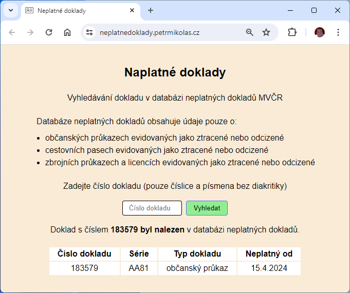

# Neplatné doklady

Webová aplikace pro vyhledávání dokladu v databázi neplatných dokladù MVÈR

Naprogramováno v jazyce C# v prostøedí Microsoft .NET 8 

- Server - ASP.NET Core
- Client - React
- API - Minimal API
- API dokumentace - OpenAPI
- Unit testy - NUnit
- Integraèní testy - NUnit
- Automatizované testy jsou spouštìny pomocí pøíslušných pøíkazù v Dockerfile bìhem sestavování obrazu Docker kontejneru
- Sledování chyb - Sentry

